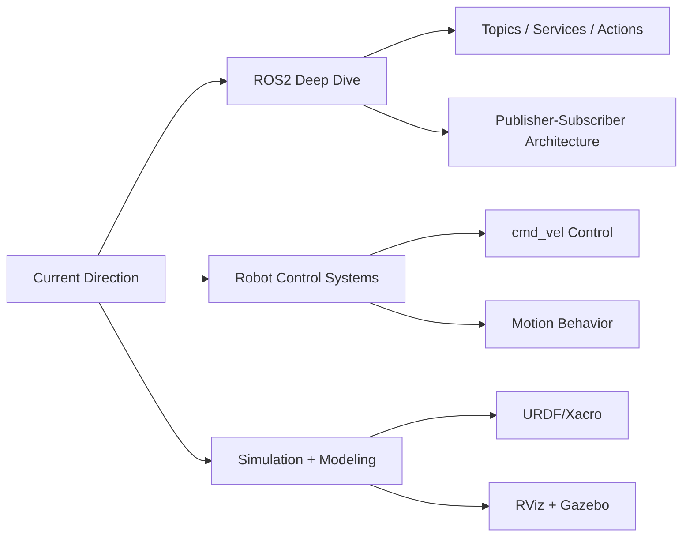

<div align="center">

# 👋 Pratyush Vatsa

### 🚀 Full-Stack Developer → Robotics Engineer (ROS2)

### 💡 Systems Thinking | 🤖 Autonomous Systems | ⚙️ Building Real-World Tech

[](https://github.com/Pratyush150)
[](https://github.com/Pratyush150)


</div>

---

## 🎯 About Me

```typescript
const pratyush = {
    location: "India 🇮🇳",
    currentRole: "Full-Stack Developer transitioning into Robotics",

    focusAreas: [
        "ROS2 (Robot Operating System)",
        "Autonomous Navigation & Control",
        "Robot Modeling (URDF/Xacro)",
        "Simulation (RViz, Gazebo)",
        "System Design & Scalable Architectures"
    ],

    techBackground: [
        "Next.js, React, TypeScript",
        "Node.js, Express, PostgreSQL, MongoDB",
        "Three.js & Interactive 3D Systems"
    ],

    currentGoal: "Building intelligent robotic systems that interact with the real world",

    mindset: "Understand systems deeply. Build with intent. Optimize continuously."
};
```

<div align="center">

**💬 "From writing code to building systems that move, sense, and decide."**

</div>

---

## 🧠 Technical Focus

<div align="center">

### 🤖 Robotics & Systems


### 💻 Software Engineering


### ⚙️ Tools


</div>

---

## 🔥 Featured Work

### 🤖 Mobile Robot (ROS2 + URDF)

* Designed a differential drive robot using URDF
* Implemented:

  * Base chassis
  * Wheel joints (continuous)
  * LiDAR sensor mount
* Working with:

  * `cmd_vel` velocity control
  * ROS2 nodes (publisher/subscriber)
  * Timer-based execution

👉 Focus: Understanding robot structure + motion control pipeline

---

### 🌌 KAIRO STUDIO (Full-Stack System)

* Built a 3D immersive platform with real-time interaction
* Integrated authentication, database, and dashboard systems
* Optimized rendering performance and UX

👉 Focus: System design + scalable architecture

---

### 🎓 CampusConnect

* Social platform with real-time features
* Designed modular frontend and backend systems

👉 Focus: distributed systems thinking

---

## ⚙️ Current Work


```mermaid
graph LR
    A[Current Direction] --> B[ROS2 Deep Dive]
    A --> C[Robot Control Systems]
    A --> D[Simulation + Modeling]

    B --> B1[Topics / Services / Actions]
    B --> B2[Publisher-Subscriber Architecture]

    C --> C1[cmd_vel Control]
    C --> C2[Motion Behavior]

    D --> D1[URDF/Xacro]
    D --> D2[RViz + Gazebo]
```

---

## 🚧 What I'm Building Now

* ROS2 nodes (publisher/subscriber + timers)
* Robot motion logic (wall detection, circular movement)
* URDF-based robot models
* Simulation workflows (RViz)

---

## 🎯 Next Targets

* ROS2 Navigation Stack (Nav2)
* SLAM (Simultaneous Localization and Mapping)
* Sensor integration (LiDAR, camera)
* Gazebo physics-based simulation
* ROS2 Control (hardware interfaces)

---

## 📫 Connect

<div align="center">

[](https://linkedin.com/in/pratyush-vatsa)
[](https://github.com/Pratyush150)
[](mailto:pratyush150@users.noreply.github.com)

</div>

---

## 🧭 Philosophy

```text
Build systems, not just features.
Understand flow, not just code.
Think in architecture, not syntax.
```

---

<div align="center">

⭐ If you're into robotics, systems, or building real-world tech — let's connect.

</div>
