<div align="center">

# 👋 Hey, I'm Pratyush Vatsa

### 🚀 Full-Stack Developer | 💡 Problem Solver | 🎯 Building the Future

[](https://github.com/Pratyush150)
[](https://github.com/Pratyush150)


</div>

---

## 🎨 About Me

```typescript
const pratyush = {
    pronouns: "He" | "Him",
    location: "India 🇮🇳",
    role: "Full-Stack Developer",
    passion: "Building immersive web experiences & scalable applications",

    currentFocus: [
        "Next.js 14 & React Server Components",
        "3D Web Graphics (Three.js, R3F)",
        "Full-Stack PERN Applications",
        "Cloud Architecture & DevOps"
    ],

    codePhilosophy: "Clean code, elegant solutions, continuous learning",

    whenNotCoding: [
        "Exploring new technologies 🔍",
        "Contributing to open source 🌟",
        "Learning system design 📚",
        "Drinking coffee ☕"
    ],

    funFact: "I debug in production... just kidding! 😄"
};
```

<div align="center">

**💬 "Turning complex problems into elegant code"**

</div>

---

## 🛠️ Tech Stack

<div align="center">

### 🎯 Languages & Core


### ⚛️ Frontend Frameworks


### 🔧 Backend & Database


### 🚀 Tools & Platforms


</div>

---

## 🔥 Featured Projects

<div align="center">

<table>
<tr>
<td width="50%">

### 🌌 KAIRO STUDIO - Automation Universe
**Full-Stack 3D Immersive Platform**

A next-generation web application combining cutting-edge 3D graphics with powerful business automation tools. Features interactive orbital navigation, complete authentication, and database-backed services.

**Tech Stack:**
- Next.js 14 + TypeScript
- React Three Fiber + Three.js
- Prisma ORM + PostgreSQL
- JWT Authentication + Bcrypt
- Tailwind CSS

**Highlights:**
- ✨ Interactive 3D orbital navigation
- 🔐 Complete auth system (JWT)
- 💾 Database-backed (5 models)
- 📱 Performance optimized (60 FPS)
- 🎨 Glass-morphism UI design
- 📊 Protected dashboard
- 🚀 Production-ready

**Links:**
- [Live Demo](http://152.67.2.20:3000)
- [Repository](https://github.com/Pratyush150/Kairo_studio_website)
- [Documentation](https://github.com/Pratyush150/Kairo_studio_website/tree/main/docs)

**Status:** ✅ Production Ready | 14/14 Routes | 86% Complete

</td>
<td width="50%">

### 📺 VidTube Platform
**YouTube-Inspired Video Platform**

A comprehensive video streaming platform with user authentication, video upload, and social features.

**Tech Stack:**
- JavaScript + React
- Node.js + Express
- MongoDB

**Features:**
- Video upload & streaming
- User authentication
- Comments & likes
- Responsive design

[View Project →](https://github.com/Pratyush150/CompleteVidTubeProjectInspiredFromYoutube)

---

### 🎓 CampusConnect
**Campus Social Networking**

A social networking platform designed for campus communities with real-time features.

**Tech Stack:**
- React + Node.js
- WebSocket (real-time)
- MongoDB

**Features:**
- User profiles
- Real-time messaging
- Event management
- Campus news feed

[View Project →](https://github.com/Pratyush150/CampusConnect)

</td>
</tr>
</table>

</div>

---

## 💼 What I'm Working On

```mermaid
graph LR
    A[🔭 Current Focus] --> B[KAIRO STUDIO]
    A --> C[Phase G Optimization]
    A --> D[System Design]

    B --> B1[Analytics Integration]
    B --> B2[A/B Testing]
    B --> B3[Accessibility Audit]

    C --> C1[Lighthouse Optimization]
    C --> C2[Performance Monitoring]

    D --> D1[Microservices Architecture]
    D --> D2[Cloud Deployment AWS]

    style A fill:#667eea,stroke:#764ba2,stroke-width:3px,color:#fff
    style B fill:#f093fb,stroke:#f5576c,stroke-width:2px,color:#000
    style C fill:#4facfe,stroke:#00f2fe,stroke-width:2px,color:#000
    style D fill:#43e97b,stroke:#38f9d7,stroke-width:2px,color:#000
```

<div align="center">



</div>

### 🎯 Current Priorities

<table>
<tr>
<td width="33%">

#### 🚀 Building
- **KAIRO STUDIO Phase G**
  - Analytics integration
  - A/B testing framework
  - Performance monitoring
  - Accessibility audit (WCAG 2.1 AA)

- **Next Projects**
  - Microservices architecture
  - Real-time collaboration tools
  - AI-powered features

</td>
<td width="33%">

#### 🌱 Learning
- **Cloud & DevOps**
  - AWS (EC2, S3, Lambda)
  - Docker & Kubernetes
  - CI/CD pipelines

- **Advanced Topics**
  - System Design patterns
  - Distributed systems
  - GraphQL & tRPC
  - WebAssembly

</td>
<td width="33%">

#### 🤝 Collaborating
- **Open to:**
  - Innovative web projects
  - 3D web experiences
  - Full-stack applications
  - Open source contributions

- **Interested in:**
  - Next.js projects
  - React Three Fiber
  - PERN stack apps
  - Design systems

</td>
</tr>
</table>

---

<div align="center">

## 📫 Let's Connect!

[](https://linkedin.com/in/pratyush-vatsa)
[](https://twitter.com/pratyush150)
[](mailto:pratyush150@users.noreply.github.com)
[](http://152.67.2.20:3000)

---

### 💭 "First, solve the problem. Then, write the code." - John Johnson

**Thanks for visiting! Feel free to explore my repositories and don't forget to ⭐ projects you find interesting!**


</div>
